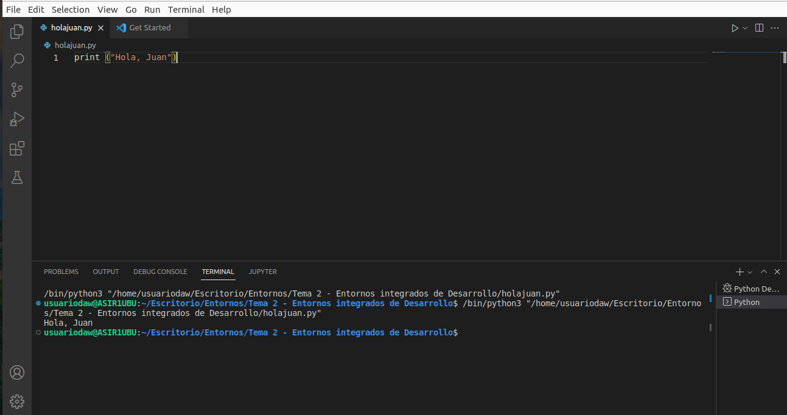
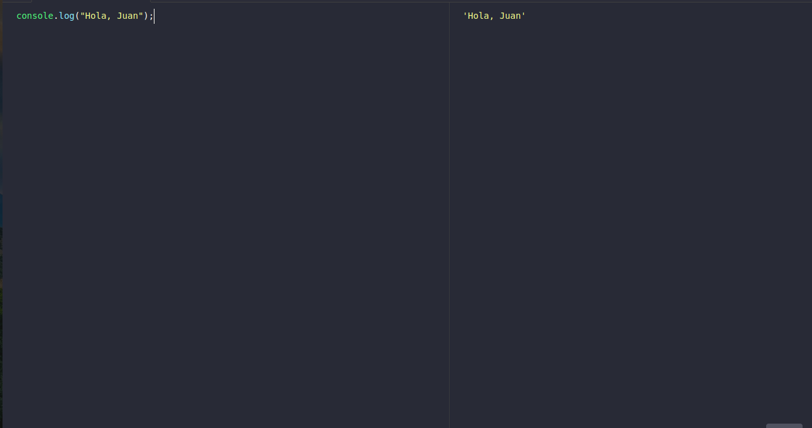
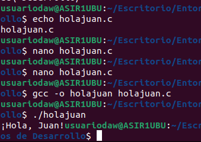
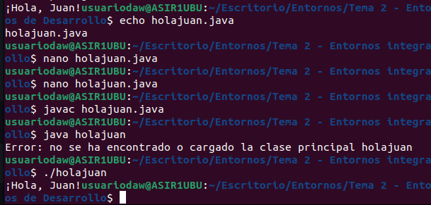
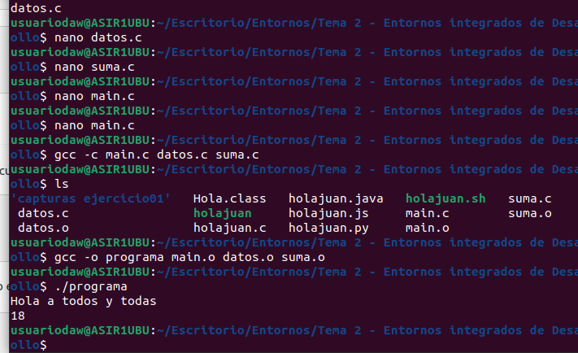

## Ejercicio 1: Ejecuta un hola mundo en distintos lenguajes

### Bash:

<pre><code>echo "Hola, Juan";</code></pre>

### Python: 

<pre><code>print ("Hola, Juan")</code></pre>

### Javascript

<pre><code>console.log("Hola, Juan");</code></pre>

### C

<pre><code>
int main()
{
    printf("¡Hola, Juan!");
    return 0;
}</code></pre>

### Java

<pre><code>class Hola
{
    public static void main(String[] args)
    {
        System.out.println("Hola Juan");
    }
}</code></pre>	

## Ejercicio 2: Para cada uno de los lenguajes anteriores, indica el proceso realizado  para conseguir ejecutar el código: ¿compilación o interpretación?

(he dejado algunas capturas de pantalla donde se ve el proceso de complilación y ejecución)

- Bash --> utilizamos el interprete de la consola de linux, por tanto es un lenguaje interpretado
- Python --> descargando la extensión de phython, lo hice por Visual studio Code. También fue un lenguaje interpretado.
- JavaScript --> LO hicimos en un intérprete de JS online, por tanto otro interpretado.
- C --> Con C tuvimos que compilar y ejecutar en la consola de Linux
- Java --> ionterpretación, compilación y ejecución en la consola de Linux.

## Ejercicio3: Para cada uno de los lenguajes anteriores, indica el nombre del compilador o interprete utilizado en GNU/Linux.

Bash - Terminal, Python - VS Code, Javascript - RunJS, C - terminal, Java - Terminal.

## Ejercicio 04: 

bash --> .sh

python --> .py

php --> .php

javascript --> .js

c --> .c

c++ --> .cpp

java --> .java

ensamblador --> .asm

ruby --> .rb

go --> .go

rust --> .rs

lisp --> .lisp

## Ejercicio 06

Los archivos de código objeto tienen la extensión .obj o la extensión .o

## Ejercicio 07-08

## Ejercicio 11

Las bibliotecas se puedend definir como un conjunto de archivos objeto que extienden la funcionalidad del lenguaje, es decir, nos permiten poder hacer más cosas y programas más complejos en cada lenguaje de programación.

## Ejercicio 12

Es más común el uso de bibiliotecas dinámicas para la funcionalidad básica, y el uso de plugins se deja para la funcionalidad opcional.

## Ejercicio 13

<pre><code> 
gcc  -c  -fPIC  aritmetica.c

gcc  -shared  -fPIC  -o  libaritmetica.so  aritmetica.o

cp  libaritmetica.so  /lib
</code></pre>

## Ejercicio 14

<pre><code> 
mkdir  aritmetica

javac  aritmetica/Aritmetica.java

jar  cvf  aritmetica.jar  aritmetica/*.class

mv  aritmetica.jar  /usr/lib/jvm/java-8-openjdk-amd64/jre/lib/ext/aritm.jar

</code></pre>

## Ejercicio 15

#### Ventaja:

1. No es necesario proporcionar las bibliotecas correspondientes al publicar el programa.

2. Biblioteca de carga rápida

#### Desventaja

1. La biblioteca está empaquetada en la aplicación, lo que resulta en una gran biblioteca.

2. La biblioteca ha cambiado y es necesario volver a compilar el programa.

## Ejercicio 16

#### Ventajas: 
1) Ahorra más memoria y reduzca el intercambio de páginas.
2) El archivo so es independiente del archivo EXE, siempre que la interfaz de salida permanezca igual (es decir, el nombre, los parámetros, el tipo de valor de retorno y la convención de llamada no cambien), reemplazar el archivo so no causará el archivo EXE Cualquier impacto, mejorando así la capacidad de mantenimiento y la escalabilidad.
3) Los programas escritos en diferentes lenguajes de programación pueden llamar a la misma para que funcionen siempre que sigan la convención de llamada de función.
4) Es adecuado para el desarrollo de software a gran escala, lo que hace que el proceso de desarrollo sea independiente y menos acoplado, lo que es conveniente para el desarrollo y las pruebas entre diferentes desarrolladores y organizaciones de desarrollo.

#### Desventajas

1) El archivo ejecutable generado por el enlace estático es de gran tamaño y contiene el mismo código común, lo que causa desperdicio.
2) La aplicación que usa la biblioteca de enlaces dinámicos no es autónoma, y el módulo del que depende también debe existir. Si usa enlaces dinámicos al cargar, la DLL no existe cuando se inicia el programa. El sistema terminará el programa y dará un mensaje de error. Con el enlace dinámico en tiempo de ejecución, el sistema no terminará, pero debido a que la función exportada no está disponible, el programa no se cargará; la velocidad es más lenta que el enlace estático. Después de actualizar un determinado módulo, si el nuevo módulo no es compatible con el módulo anterior, se arrancará todo el software que necesita el módulo para ejecutarse.

## Ejercicio 17

<pre><code> 
make

gcc -O  -c  main.c
gcc -O  -c  -fPIC  aritmetica.c
gcc -O  -shared  -fPIC  -o  libaritmetica.so  aritmetica.o
gcc -O  -Wl,-rpath=/usr/local/lib  main.o  libaritmetica.so  -o  programa

</code></pre>

## Ejercicio 19

